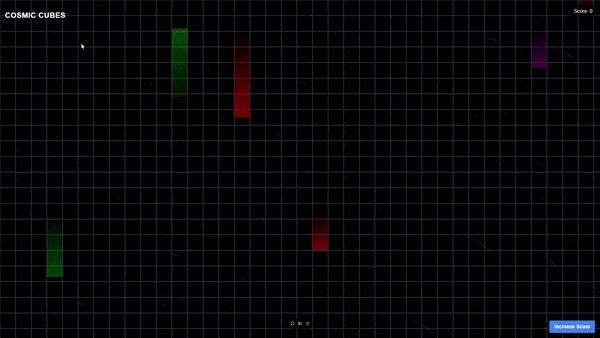

## Cosmic Cube
A visually stunning Next.js application that creates an interactive grid of cubes with animated light beams. This project demonstrates the power of React and CSS animations to create an engaging, game-like visual experience.
### Features
Full-screen grid of cubes that adapts to any screen size
Colorful light beams that animate vertically through the grid
Responsive design that works on desktop and mobile devices
Built with Next.js and Tailwind CSS for modern web development practices

## Demo


## Installation

If you wish to build the project locally and see what my website looks like, you can run the following command to first get my project on your system:

```bash
git clone https://github.com/AnkitSingh0702/Cosmic_Cubes

cd Cosmic_Cubes
```
Install the dependencies:

```bash
npm install
```
start the development server:
```bash
npm run dev
# or
yarn dev
# or
pnpm dev
# or
bun dev
```

Open [http://localhost:3000](http://localhost:3000) with your browser to see the result.

You can start editing the page by modifying `app/page.tsx`. The page auto-updates as you edit the file.

This project uses [`next/font`](https://nextjs.org/docs/app/building-your-application/optimizing/fonts) to automatically optimize and load [Geist](https://vercel.com/font), a new font family for Vercel.

## Learn More

To learn more about Next.js, take a look at the following resources:

- [Next.js Documentation](https://nextjs.org/docs) - learn about Next.js features and API.
- [Learn Next.js](https://nextjs.org/learn) - an interactive Next.js tutorial.

You can check out [the Next.js GitHub repository](https://github.com/vercel/next.js) - your feedback and contributions are welcome!

## Deploy on Vercel

The easiest way to deploy your Next.js app is to use the [Vercel Platform](https://vercel.com/new?utm_medium=default-template&filter=next.js&utm_source=create-next-app&utm_campaign=create-next-app-readme) from the creators of Next.js.

Check out our [Next.js deployment documentation](https://nextjs.org/docs/app/building-your-application/deploying) for more details.
